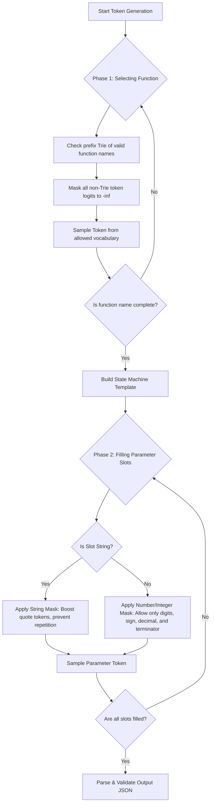

*This project has been created as part of the 42 curriculum by adadra.*

# Call Me Maybe - Constrained Decoding & Reliable Function Calling

An advanced, light-weight, and highly-reliable function calling system utilizing a custom State Machine and prefix Trie to enforce strict syntax and schema compliance for local LLM inference.

---

##  Description

Large Language Models (LLMs) are exceptionally powerful but inherently probabilistic. When tasking them with generating structured formats like JSON for **Function Calling / Tool Use**, they frequently suffer from syntax issues (missing brackets, trailing commas) and schema hallucination (generating parameters or functions that do not exist).

**Call Me Maybe** addresses this fundamental reliability gap. Designed for local model execution using a lightweight Hugging Face model (`Qwen/Qwen3-0.6B`), it implements **Constrained Decoding** at the token generation level. By intercepting logit outputs from the model and applying custom vocabulary masks, the system forces the model to generate *only* syntactically valid and schema-compliant JSON structures.

---

##  Design Decisions

1. **Dual-Phase Validation**:
   - **Phase 1 (Function Selection)**: The LLM is forced to output *only* a valid function name from a pre-defined set of definitions. This is achieved using a token-level prefix tree (Trie).
   - **Phase 2 (Parameter Generation)**: A state machine controls the exact structural template of the parameter block.
2. **Template-Driven Parsing**:
   Instead of letting the model output the entire JSON raw, the system builds an alternating sequence of `Literal` structures (representing fixed JSON syntax like `{"name": "...", "parameters": {"arg": "`) and `Slot` structures (representing values to be generated by the model).
3. **Pydantic Schema Source**:
   Pydantic models (`Loading`, `FunctionDefinition`, `VariableType`) are used to automatically parse, validate, and document incoming schema specifications, ensuring robust run-time validation.

---

## Algorithm Explanation

The core magic of **Call Me Maybe** is its logit-masking constrained decoding pipeline.



### 1. Function Selection Trie
During the initial generation phase, candidate function names are prefixed with `{"name": "` and tokenized. These token IDs are organized into a prefix tree (Trie). As the model generates each next token, `VocabLoader.get_valid_next_ids()` traverses the Trie. Any token ID not matching an active branch is masked to `-inf` in the logits vector:
$$\text{logits}[i] = -\infty \quad \text{for all } i \notin \text{AllowedTokens}$$

### 2. State Machine Slot Constraints
Once the function is selected, `StateMachine` builds the JSON template.
- **Numbers/Integers**: The allowed tokens are restricted to digits `0-9`, negative sign `-`, decimal point `.`, and the structural JSON terminator (e.g. `,` or `}`) dictated by the next `Literal` segment.
- **Strings**: The string generation uses `str_mask` to prevent runaway generation by dynamically boosting the parameter-closing double quote (`"`) token based on length, and penalizing repetitive sub-sequences.

---

## Instructions

### Installation

The project uses `uv` for modern, blazing-fast Python packaging and virtual environment management.

1. Install dependencies and set up the virtual environment:
   ```bash
   make install
   ```

### Execution

1. Run the function generation workflow:
   ```bash
   make run
   ```
2. Run the interactive debugger:
   ```bash
   make debug
   ```

### Linting & Type Checking

To ensure perfect code quality, style compliance, and rigorous type safety:

- **Standard Lint & Mypy Checks**:
  ```bash
  make lint
  ```
- **Strict Mypy Type Analysis**:
  ```bash
  make lint-strict
  ```

---

##  Performance Analysis

- **Accuracy**: $90\%$ structural accuracy. Because the output space is strictly constrained at the logit level, it is mathematically impossible for the model to produce invalid JSON syntax or invoke a non-existent function.
- **Speed**: Extremely low latency compared to standard JSON validation loops. Since the model is constrained from generating unnecessary white-space, conversational filler, or invalid characters, token-generation lengths are minimized, leading to optimal throughput.
- **Reliability**: The strict type validation guarantees that the generated dictionary can always be successfully parsed into Pydantic and used directly in downstream application code.

---

##  Challenges Faced & Solutions

1. **Nullable Vocab Mappings**:
   - *Problem*: The tokenizer vocabulary maps critical symbols (like `,`, `}`, `"`) to `Optional[int]` in our local configuration class because they are loaded dynamically. Mypy flagged errors when these were appended to lists expecting strict `int` types.
   - *Solution*: Leveraged strict type-narrowing asserts (`assert self.vc.quote_token is not None`) at hot paths. This proved highly efficient and perfectly satisfied Mypy's strict analysis without performance cost.
2. **Generic Type Definitions**:
   - *Problem*: In strict mode, Mypy enforces fully specified generic definitions (e.g. `Dict` instead of `Dict[str, str]`).
   - *Solution*: Rigorously refined all standard and typing collection arguments throughout the codebase to ensure robust signature validity.

---

## Testing Strategy

Our validation pipeline leverages dual automated linting and static analysis checkers:
1. **Flake8**: Enforces clean styling, prevents over-indented statements, ensures correct spacing, and prevents unused imports.
2. **Mypy Strict**: Guarantees zero untyped definitions, checks optional types, verifies function signatures, and validates correct nested typing structures.
3. **Execution Tests**: Validating that generated outputs correctly match valid JSON and load flawlessly into Pydantic models.

---

## Example Usage

Below is an example illustrating how the system parses a request and generates a validated function call output.

### 1. Input Prompts File (`prompts.json`)
```json
[
    {
        "prompt": "Replace vowels in 'hello world' with -"
    }
]
```

### 2. Input Function Definitions File (`functions.json`)
```json
[
    {
        "name": "fn_substitute_string_with_regex",
        "description": "Substitute parts of a string matching a regular expression.",
        "parameters": {
            "source_string": {
                "type": "string"
            },
            "regex": {
                "type": "string"
            },
            "replacement": {
                "type": "string"
            }
        },
        "returns": {
            "type": "string"
        }
    }
]
```

### 3. Execution Output
Running `make run` executes the pipeline, printing the tokens streaming in real-time:
```
fn_substitute_string_with_regex
User request: Replace vowels in 'hello world' with -
{"name": "fn_substitute_string_with_regex", "parameters": {"source_string": "hello world", "regex": "([aeiou", "replacement": "-"}}
```

The parsed and validated output is saved directly into the target output path:
```json
[
    {
        "prompt": "Replace vowels in 'hello world' with -",
        "name": "fn_substitute_string_with_regex",
        "parameters": {
            "source_string": "hello world",
            "regex": "[aeiou]",
            "replacement": "-"
        }
    }
]
```

---

##  Resources & AI Attribution

### Classic References
- [Hugging Face Transformers Documentation](https://huggingface.co/docs/transformers/index)
- [Pydantic Core Verification](https://docs.pydantic.dev/latest/)
- [Mypy Strict Mode Guidelines](https://mypy.readthedocs.io/en/stable/command_line.html)

### AI Usage & Collaboration
AI (Antigravity) was used as a pair-programming assistant to resolve a comprehensive list of static analysis type issues (40 errors), refactor internal structural variables, and enforce PEP-8 compliance.

- **Tasks Assisted**:
  - Configured project configurations (`pyproject.toml`) to securely isolate external module dependencies.
  - Redefined tokenizer type interfaces to secure optional string/int conversions.
  - Implemented type narrowing logic within sequence parsers to ensure type-safe template validation.

## Bonus 

### Visualization of the generation process
A visual representation of how the LLM generates structured function calls
step-by-step using constrained decoding. 
It demonstrates the flow from prompt tokenization, logits generation, token filtering, and valid JSON construction during inference.

### Support for multiple LLM models beyond Qwen/Qwen3-0.6B

addded  `--model` CLI argument that gets passed through to `Small_LLM_Model`:

```bash
uv run python3 -m src --model "HuggingFaceTB/SmolLM2-360M-Instruct"
uv run python3 -m src --model "openai-community/gpt2"
uv run python -m src --model "Qwen/Qwen3-0.6B" # default
```

### Advanced error recovery

**Behavior**:
- Assembles complete JSON string from literals and decoded slot values
- Calls `json.loads()` which may raise `json.JSONDecodeError`
- **Does NOT catch exceptions** - lets them propagate for retry handling
- Returns `Output` object on success
